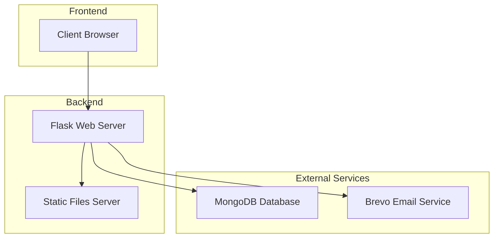
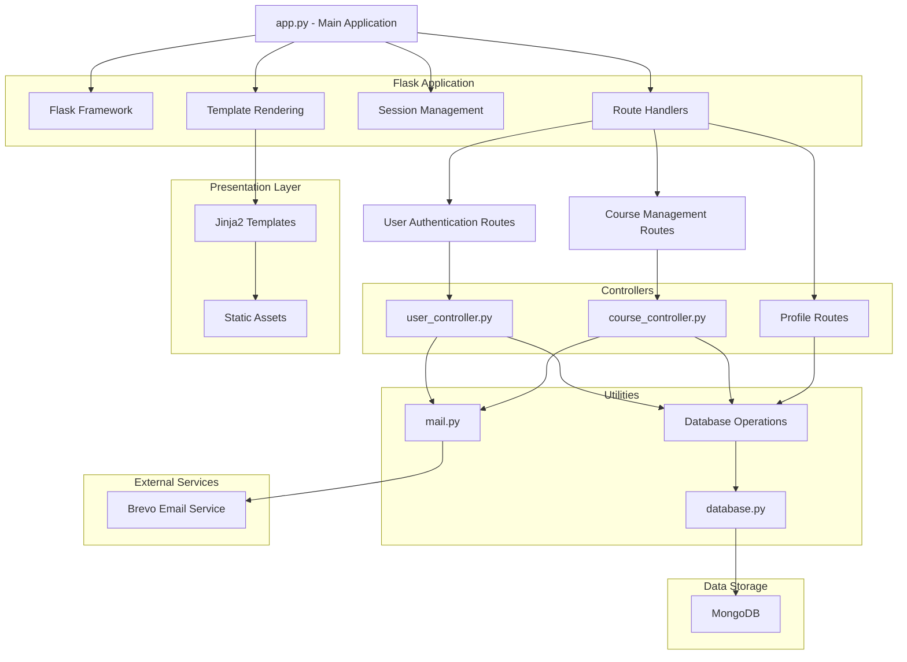
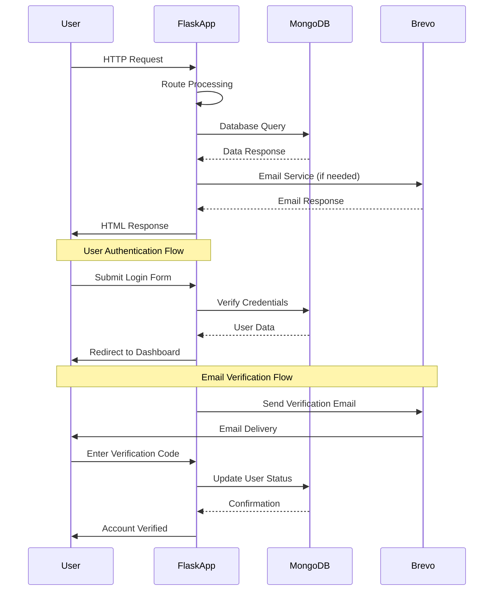

# AI Agent System - Architecture

## System Architecture Overview

The AI Agent System follows a client-server architecture with a Flask backend and HTML/CSS/JavaScript frontend. The system is designed to be modular, scalable, and maintainable.



## High-Level Architecture

### 1. Client Layer (Frontend)
- HTML templates rendered by Jinja2
- CSS styling with Bootstrap 5
- JavaScript for interactive elements
- Responsive design for all devices

### 2. Application Layer (Backend)
- Flask web framework for routing and request handling
- Utility modules for business logic
- Session management for user authentication
- CSRF protection for security

### 3. Data Layer
- MongoDB for persistent data storage
- Two main collections: `usertable` and `course_enrollments`
- Indexes for performance optimization

### 4. External Services
- Brevo API for email delivery
- Static file serving for CSS, JS, and images

## Component Diagram



## Data Flow Diagram



## Module Architecture

### Main Application (app.py)
- Entry point for the Flask application
- Route definitions for all endpoints
- Session management and authentication checks
- Template rendering with context data

### User Controller (utils/user_controller.py)
- User registration and authentication logic
- Password hashing and verification
- Email verification workflows
- Password reset functionality

### Course Controller (utils/course_controller.py)
- Course enrollment management
- Schedule configuration processing
- Email notification handling
- Course data retrieval

### Database Utility (utils/database.py)
- MongoDB connection management
- Database operation abstractions
- Collection access functions
- Error handling for database operations

### Mail Utility (utils/mail.py)
- Email template generation
- Brevo API integration
- Email sending functionality
- Error handling for email delivery

### Environment Loader (utils/env_loader.py)
- Environment variable loading
- Configuration validation
- Default value handling

## Database Schema

### User Table (usertable)
```javascript
{
  "_id": ObjectId,
  "name": String,
  "email": String,
  "password": String,
  "code": Number,
  "status": String
}
```

### Course Enrollments (course_enrollments)
```javascript
{
  "_id": ObjectId,
  "user_id": String,
  "course_id": String,
  "course_name": String,
  "schedule": Object,
  "status": String
}
```

## Security Architecture

### Authentication Flow
1. User submits credentials
2. Password verification with Werkzeug
3. Session creation with Flask
4. CSRF token generation
5. Protected route access validation

### Data Protection
- Passwords hashed with PBKDF2
- Sensitive data in environment variables
- Session encryption with SECRET_KEY
- Input validation and sanitization

### Communication Security
- HTTPS recommended for production
- Secure headers configuration
- CSRF protection for forms
- Session timeout handling

## Scalability Considerations

### Horizontal Scaling
- Stateless Flask application
- Session storage in database (future enhancement)
- Load balancer compatibility
- Caching strategy (future enhancement)

### Database Scaling
- Index optimization
- Query performance monitoring
- Collection sharding potential
- Read replica support

### Performance Optimization
- Static file caching
- Database connection pooling
- Template caching
- CDN integration for assets

## Deployment Architecture

### Development Environment
- Local MongoDB instance
- Flask development server
- Direct file access for static assets

### Production Environment
- MongoDB Atlas or dedicated server
- WSGI server (Gunicorn/uWSGI)
- Reverse proxy (Nginx/Apache)
- CDN for static assets
- Load balancer for high availability

## Monitoring and Logging

### Application Logging
- Request/response logging
- Error tracking
- Performance metrics
- Security event logging

### Database Monitoring
- Query performance
- Connection pooling
- Storage utilization
- Index usage

### External Service Monitoring
- Email delivery tracking
- API response times
- Error rate monitoring
- Service availability